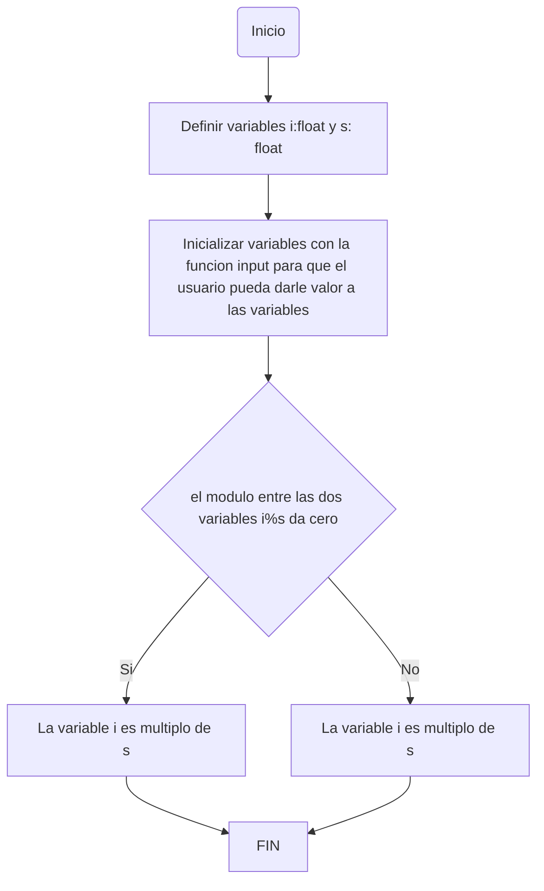
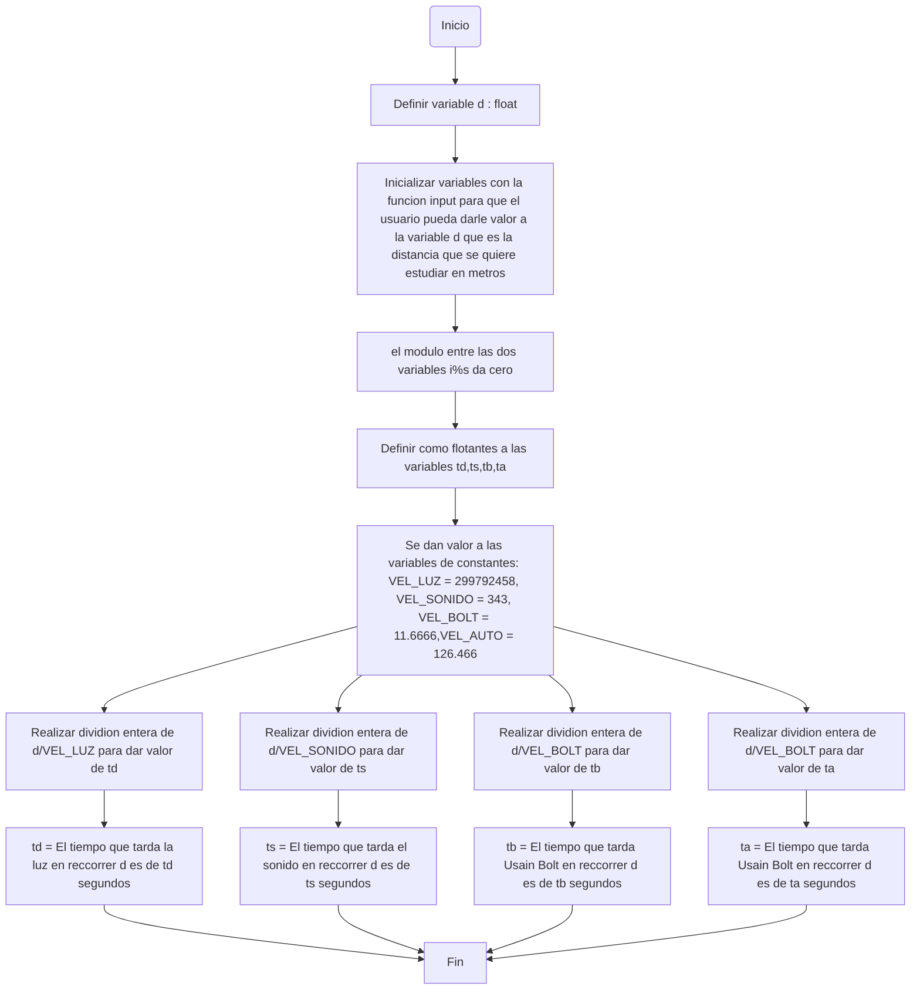

# Taller-1  :smile: :computer: :smile:

# Grupo: Team rocket cazadores de pockebugd


## Desarrollo de taller #1;   {Programación de computadores}


***1. Realice el quiz Python Beginner Quiz (20 preguntas) y adjunte pantallazo con el resultado (mínimo 90% bien)*** :pencil:


**Quiz de : Daniel Alejandro Archila Gómez.**


[](https://postimg.cc/rDfJ2rkZ)


**Quiz de: Maria Fernanda León Montoya.**


[](https://postimg.cc/YjQ4Y1PJ)


***2.Realice un programa que lea tres números reales y determine cuál es el mayor.***

```ruby
a : float
b : float
c : float

a = float(input("Ingrese el primer número: "))
b = float(input("Ingrese el segundo número: "))
c = float(input("Ingrese el tercer número: "))
if a > b and a > c:
    print("El primer número " + str(a) + "  es el mayor ")
elif b > a and b > c:
    print("El segundo número " + str(b) + " número es el mayor ")
else:
    print("El tercer número " + str(c) + " número es el mayor ")

```


## Explicación:

**Este programa tiene declaradas sus variables y inicializadas; a este programa se le ingresan tres números reales y este determina cual es el número mayor de los ingresados.**

**Esto lo realiza con tres variables, usando desigualdades y utilizando if, elife y else**


***3.Realice un programa que lea un número enteros y determine si es par o impar.***


```ruby
n : int
n = int(input("Ingrese el número "))
if n % 2 == 0:
    print("El número " + str(n) + " es par")
else:
    print("El número " + str(n) + " es impar")
 ```
 
 
 
 
 
 
 
 
 
 ## Explicación: 
  
 ***Este programa tiene una sola variable que n, la cual es un entero.***
 ***El programa esta diseñado para leer un numero entero y determinar si este es impar o par, por medio la opercion de modulo.***
 *** A la variable n se le aplica modul de dos y si este es igual a cero significa que n es un numero par, pero el resultado de esta oparacion es diferente a 0 significa que n es un numero impar***
 
 
 
 
 
 
 
 
 
 
 
 
 
 
 
 
 
 
 
 
 
 
 
 
 


***4.Realice un programa que lea dos números reales y determine si el primero es múltiplo del segundo.***


```ruby
i : float
s : float
#El número mayor a evaluar debe ser el primero que se ingrese.

i = float(input("Ingrese el primer número"))
s = float(input("Ingrese el segundo número"))
if i % s == 0:
    print("El número " + str(i) + " es multiplo de " + str(s) )
else:
    print("El número " + str(i) + " no es multiplo de " + str(s) )
```

## Explicación : 


***Este programa lee dos numeros reales y determina si el primero es muiltiplo del segundo***
***Tiene 2 variables las cuales son i y s, las cuales son flotantes y para determinar si i es multiplo de s : se utiliza la operacion modulo y si el modulo de i entre s es igual a cero significa que i es multiplo de s; si por otro lado el modulo no es cero significa que i no es multiplo de s***





***5.Realice un programa que lea tres números reales y determine si la suma de los dos primeros es mayor, menor o igual que el tercer número.***

```ruby
a : float
b : float
c : float

a = float(input(" Ingrese el primer número: "))
b = float(input(" Ingrese el segundo número: "))
c = float(input(" Ingrese el tercer número: "))

if a + b > c:
    print("La suma de " + str(a) + " y " + str(b) + " es mayor que "+ str(c))

elif a + b < c:
    print("La suma de " + str(a) + " y " + str(b) + " es menor que "+ str(c))
else: 
    if a + b == c:
        print("La suma de " + str(a) + " y " + str(b) + " es igual que "+ str(c))
 ```
 
 
 
 
 
 
 ## Explicación:
 


***A este programa se le ingresan tres numeros reales y dertermina si la suma de los dos primeros numeros es mayor, menor o igual que el tercer numero***

***Este programa tiene declarado y inicializado tres variables que serian los numeros que se le ingresan, el programa determina la respuesta pro medio de 2 ecuaciones en los casos que sea mayor o menor la suma de los dos primeros numeros con respecto al tercer numero, mientras que en el caso que la suma del primer numero y el segundo sea igual el programa hara una igualdad.***

***El programa da su respuesta dependiendo al resultado en la cual da los numeros ingresado y su respectiva respuesta para el codigo***


***6.Escriba un programa que solicite al usuario una letra y determine si es una vocal o una consonante.***


```ruby
letra = input("Ingresa una letra: ")

if len(letra) != 1:
    print("Error: Por favor ingresa una única letra.")
elif letra in 'aeiouAEIOU':
    print("La letra ingresada " + str(letra) + " es una vocal.")
else:
    print("La letra ingresada " + str(letra) + " es una consonante.")

```


## Explicación:

***A este programa se le ingresa una letra minuscula o mayuscula y el detemina si la letra ingresada es una vocal o una consonate, el programa solo tiene una variable que es inicializada como letra.  El programa al reconocer que hay mas de una letra expresa que solo se debe ingresar una letra.***

***El programa tiene una estructura If, elif, else en su estructura.***


***7. Escriba un programa que pida 5 números reales y calcule las siguientes operaciones:***

°El promedio

°La mediana

°El promedio multiplicativo (multilplica todos y luego calcula la raíz de la cantidad de operandos)

°Ordenar los números de forma ascendente

°Ordenar los números de forma descendente

°La potencia del mayor número elevado al menor número

°La raíz cúbica del menor número


```ruby
# Solicitar los 5 números al usuario
a = float(input("Ingrese el primer número: "))
b = float(input("Ingrese el segundo número: "))
c = float(input("Ingrese el tercer número: "))
d = float(input("Ingrese el cuarto número: "))
e = float(input("Ingrese el quinto número: "))

# Calcular el promedio
promedio = (a + b + c + d + e) / 5

# Calcular la mediana
lista_numeros = [a, b, c , d , e]
lista_numeros.sort()
if len(lista_numeros) % 2 == 0:
    mediana = (lista_numeros[len(lista_numeros)//2] + lista_numeros[len(lista_numeros)//2 - 1]) / 2
else:
    mediana = lista_numeros[len(lista_numeros)//2]

# Calcular el promedio multiplicativo
producto = a * b * c * d * e
promedio_multiplicativo = producto ** (1/5)

# Ordenar los números de forma ascendente
ascendente = sorted(lista_numeros)

# Ordenar los números de forma descendente
descendente = sorted(lista_numeros, reverse=True)

# Calcular la potencia del mayor número elevado al menor número
mayor = max(lista_numeros)
menor = min(lista_numeros)
potencia = mayor ** menor

# Calcular la raíz cúbica del menor número
raiz_cubica = abs(min(lista_numeros)) ** (1/3)

# Imprimir los resultados
print(f"El promedio de los números es: {promedio}")
print(f"La mediana de los números es: {mediana}")
print(f"El promedio multiplicativo de los números es: {promedio_multiplicativo}")
print(f"Los números ordenados de forma ascendente son: {ascendente}")
print(f"Los números ordenados de forma descendente son: {descendente}")
print(f"La potencia del mayor número ({mayor}) elevado al menor número ({menor}) es: {potencia}")
print(f"La raíz cúbica del menor número ({min(lista_numeros)}) es: {raiz_cubica}")
```


## Explicación: 

***Este codigo tiene 5 variables, que son la cantidad de numeros que necesita para realizar su tarea, estas variables son numeros reales, a los cuales se les determina el promedio; sumandolos y dividiendolos por 5. Este codigo por medio de formulas como modulo, multiplicacion, suma , etc; Determina 7 valores deseaos como: promedio, mediana, promedio multiplicativo, orden ascendente y descendente , la potencia del mayor numero elevado al menor numero y la raiz cubica del menor numero; esos valores son arrojados en numeros reales***


***8.Escriba un programa al que se le ingrese la frecuencia de una onda en hz y como salida arroje en que parte del espectro electromagnético se encuentra.***

```ruby
s : float
s = float(input(" Insertar la frecuencia deseada: ")) 

if s < 3e9:
    print("La frecuencia " + str(s) + " esta ubicada en ondas de radio" )
elif s < 3e12:
    print("La frecuencia " + str(s) + " esta ubicada en ondas de microondas" )
elif s  < 4.3e14:
    print("La frecuencia " + str(s) + " esta ubicada en ondas de infrrarrojo" )
elif s < 7.5e14:
    print("La frecuencia " + str(s) + " esta ubicada en ondas de luz visible" )

elif s < 3e17:
    print("La frecuencia " + str(s) + " esta ubicada en ondas ultravioletas" )

elif s < 3e19:
    print("La frecuencia " + str(s) + " esta ubicada en ondas de Rayos X" )
        
else:
    print("La frecuencia " + str(s) + " esta ubicada en ondas de rayos gamma" )
```

## Explicación:

***El codigo tiene una sola variable s que es un numero real, y la cual es tomada como la frecuencia deseada a estudiar, el codigo resive esta frecuencia y por medio de unos ranagos determinados este mismo expresa en que parte del expectro electromagnético se encuentra. El codigo tiene un estructurado de if, elif y else en en el.   Y la variables esta expresada en la unidad hz y el codigo en sus rangos tiene expresado equivalencias de esta unidad para saber a que espectro electromagnético corresponde***


***9.Escriba un programa que reciba el nombre en minúsculas de un país de America y retorne la ciudad capital, si el país no pertenece al continente debe arrojar país no identificado.***


```ruby
a = (input("Inserte el nombre del pais del que quiere conocer la capital; en minuscula "))

if a == "argentina":
    print("La capital de " + str(a) + " es Buenos Aires" )
elif a == "bolivia":
    print("La capital de " + str(a) + " La Paz" )
elif a == "brasil":
    print("La capital de " + str(a) + " es Brasilia" )
elif a == "canada":
    print("La capital de " + str(a) + " es Ottawa" )
elif a == "chile":
    print("La capital de " + str(a) + " es Santiago de Chile" )
elif a == "colombia":
    print("La capital de " + str(a) + " es Bogotá" )
elif a == "costa rica":
    print("La capital de " + str(a) + " es San José" )
elif a == "cuba":
    print("La capital de " + str(a) + " es La Habana" )
elif a == "ecuador":
    print("La capital de " + str(a) + " Quito" )
elif a == "estados unidos" or a == "eeuu":
    print("La capital de " + str(a) + " es Washington" )
elif a == "guatemala":
    print("La capital de " + str(a) + " es Ciudad de Guatemala  " )
elif a == "honduras":
    print("La capital de " + str(a) + " es Tegucigalpa" )
elif a == "mexico":
    print("La capital de " + str(a) + " es Ciudad de México" )
elif a == "nicaragua":
    print("La capital de " + str(a) + " es Managua" )
elif a == "panama":
    print("La capital de " + str(a) + " es Ciudad de Panamá" )
elif a == "paraguay":
    print("La capital de " + str(a) + " es Asunción" )
elif a == "peru":
    print("La capital de " + str(a) + " es Lima" )
elif a == "puerto rico":
    print("La capital de " + str(a) + " es San Juan  " )
elif a == "república dominicana":
    print("La capital de " + str(a) + " es Santo Domingo" )
elif a == "uruguay":
    print("La capital de " + str(a) + " es Montevideo" )
elif a == "venezuela":
    print("La capital de " + str(a) + " es Caracas " )
else:
    print("País no identificado")
```


## Explicación:

***Este codigo esta estructura con if, elif y else, este codigo fue el mas extenso de todos; este codigo resive el nombre de un pais de América escrito en minuscula y da respectivamente la capital del pais escrito; si el codigo no se encuentra, se expresar que el pais no ha sido identificado.   El codigo tiene una sola variable la cual es a, la cual fue directamente inicializada y la cual es el nombre del pais de América en minuscula al cual se le dara su capital***


***10.Escriba un programa que dada una distancia calcule***
°El tiempo que le tomaría a la luz recorrer la distancia.

°El tiempo que le tomaría al sonido (en el aire) recorrer la distancia.

°El tiempo que le tomaría al vehiculo comercial más veloz recorrer la distancia.

°El tiempo que le tomaría a Bolt recorrer la distancia.


```ruby
#punto 10

#d es distancia en metros 
d : float
d = float(input("Inserte la distancia que quiere estudiar en metros: " ))
#Tiempo que tarda la luz en recorrer la distancia 
td = float
#Tiempo que tarda el sonido en recorrer la distancia 
ts = float
#Tiempo que tarda Usain Bolt en recorrer la distancia 
tb = float
#Tiempo que tarda el auto en recorrer la distancia 
ta = float
#constantes expresadas en metros por segundo 
VEL_LUZ = 299792458
VEL_SONIDO = 343 
VEL_BOLT = 11.6666
VEL_AUTO = 126.466
td = d/VEL_LUZ
print("El tiempo que tarda la luz en reccorrer " + str(d) + " m es de " + str(td) + " segundos")

ts = d/VEL_SONIDO
print("El tiempo que tarda el sonido en reccorrer " + str(d) + " m es de " + str(ts) + " segundos")

tb = d/VEL_BOLT
print("El tiempo que tarda Usain Bolt en reccorrer " + str(d) + " m es de " + str(tb) + " segundos")

ta = d/VEL_AUTO
print("El tiempo que tarda el auto en reccorrer " + str(d) + " m es de " + str(ta) + " segundos")
```


## Explicación:

***Este codigo consta de una sola variable la cual es d que es la distancia, la cual se le inserta en metros; el codigo tiene 4 Constantes, expresadas en numeros reales, que son las velocidades que se quieren estudiar en la unidad de metros sobre segundos . Las constantes dividen a la variables d y permiten expresar el tiempo que requeriria cada constante en recorrer la distancia d y el tiempo esta expresado en segundos, en codigo expresa los cuatro tiempos en segundos que se demoran las constantes en recorrer la distancia ingresada d.***


